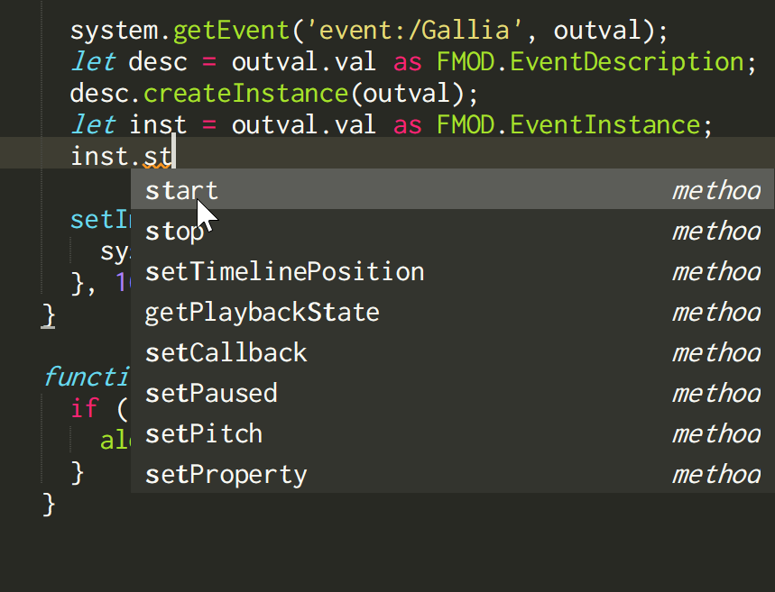
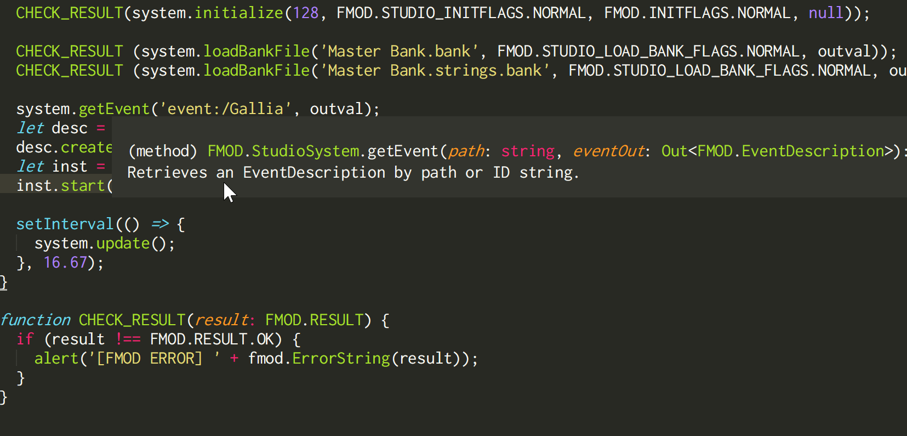

FMOD Studio TypeScript Definitions
=====================
This is a TypeScript definition file for the HTML5 version of FMOD Studio (version 2.00.04), which allows the benefits of static type checking and autocompletion for work in fmodstudio.js and TypeScript. 

For anyone new to the FMOD Studio API in HTML5 or TypeScript, here is a [starter tutorial](./StarterTutorial.md).

Usage
----------------------

Download the index.d.ts from this repository and drop it where fmodstudio.js is located in your project. Double-check that it is included in your tsconfig.json file.

Annotate the type of the FMOD object instance
```typescript
const fmod: FMOD = {};
```
Note: Do not name your FMOD object 'FMOD' since it will clash with the FMOD namespace type definitions.

Assert out-values to their corresponding types.
```typescript
let outval: any = {};
fmod.Studio_System_Create(outval);
const studioSystem = outval.val as FMOD.StudioSystem;
```

Feel great that you have type-checking and quick access to the entire FMOD API :)






